# Introduktion til systemdesign

Lektion 1

## Agenda

- Introduktion til Systemdesign kurset
- Recap af agil tilgang
- Systemudviklingsmodeller
- Opstart af eXtreme programming

Til næste gang…

## Kursets emner

- Systemudviklingsmetoder ​
- Design og arkitektur ​
- Projekt
- Eksamen

Kurset vil have et stort fokus på brug af AI

## Studieordning  -  læringsmål

Viden ​ - den studerende har:​ 
- viden om kravindsamling og kravbeskrivelse.​ 
- viden om modeller til omformning af krav til løsningsarkitektur.​
- viden om modelbaseret softwaredesign.​

Færdigheder​ - den studerende kan:​
- anvende metoder og modeller til udarbejdelse af en løsningsarkitektur.​ 
- anvende standarder som en integreret del af en løsningsarkitektur.​ - anvende arkitektur patterns som grundlag for en løsningsarkitektur.​- vurdere praksisnære og teoretiske problemstillinger inden for modelbaseret softwaredesign samt begrunde og vælge relevante løsningsmodeller.​ 
- formidle en løsningsarkitektur til relevante interessenter.​

Kompetencer​ - en studerende kan:​ 
- håndtere komplekse og udviklingssituationer med at analysere krav og metodisk og struktureret udarbejde en løsningsarkitektur baseret på standarder og arkitektur patterns.​ 
- identificere egne læringsbehov og udvikle egen viden, færdigheder og kompetencer i relation til udarbejdelse af løsningsarkitekturer.​

https://katalog.kea.dk/course/4111406/2025-2026

## Undervisningsform

”Undervisning vil være en vekselvirkning mellem præsentation, øvelser og projektarbejde.”  ( https://katalog.kea.dk/course/4111406/2023-2024 )

- I skal øve jer I selv at opsøge information, så I kommer i højere grad til at være opsøgende omkring nye emner.
- Udforske brugen af AI

## Eksamensform

- Fælles prøve med Enterprise Arkitektur og Projektledelse
- Kendte spørgsmål
- Ingen forberedelse
- 30 min. ink. votering med kendte spørgsmål

## Projekter

- Fælles projekt med Enterprice Arkitektur og Projektledelse
- Afsluttende projekt
- Det er IKKE et eksamensprojekt

## Lektionsoversigt

| Week | Date | Emne |
|------|------------|-----------------------------------------------------------------------|
| 5 | 29-01-26 | Introduktion til faget - recap af systemudviklingsmetoder - agile |
| 6 | 05-02-26 | Krav - FURPS - function vs non-functionel - MoSCoW-modellen - Abstraktion - context model - domain model - klassediagram|
| 7 | 12-02-26 | Prompt as a spec - vibe coding |
| 8 | 19-02-26 | XP - TTD |
| 9 | 26-02-26 | Burn down, poker planning, retrospective, etc. agile stuff |
| 10 | 05-03-26 | Sammenligning af metoder |
| 11 | 12-03-26 | Arkitektur |
| 12 | 20-03-26 | Arkitektur - også AI - MCP vs. API - AI arkitektur  |
| 13 | 26-03-26 | Buffer |
| 15 | 09-04-26 | Projekt |
| 16 | 17-04-26 | Design patterns |
| 17 | 23-04-26 | AI design |
| 18 | 30-04-26 | Clean code og legecy code |
| 19 | 07-05-26 | Projekt - opsamling - buffer |
| 21 | 21-05-26 | Projekt |
| 22 | 28-05-26 | Projekt |

# Recap af systemudviklingsmetoder

## Flipped class room

## Metoder – vandfald – ”plan driven”

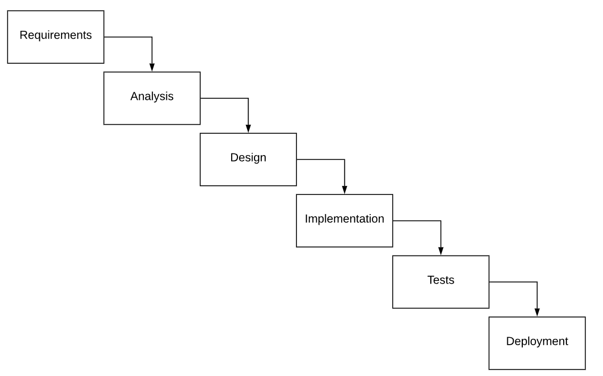

 "Big Design Up Front"

## Agile

- ”Opfundet” pga. ”overrun” i projekter
- XP, Scrum, Kanban (SAFe)
- Målet/salgstalen er – hele tiden at give kunden/brugeren den størst mulige værdi

"Emergent Design"

## Agile

- Iterative development : The process is broken down into short cycles called sprints or iterations, typically lasting 2-4 weeks.
- Continuous delivery : Working software is produced and delivered at the end of each iteration3.
- Customer collaboration : There is frequent interaction with customers or stakeholders to gather feedback and adjust requirements.
- Adaptability : The process embraces change and allows for quick pivots based on new information or evolving needs.
- Cross-functional teams : Development teams are self-organizing and include members with various skills needed to complete the project.
- Prioritization of features : The team focuses on delivering the most valuable features first, based on customer needs.
- Continuous improvement : The team regularly reflects on their process and makes adjustments to improve efficiency.
- Emphasis on working software : The primary measure of progress is functional software rather than comprehensive documentation.

## Søger at løse...

- Hurtige ændringer i krav
- Teknologi bliver forældet før det er klart
- Minimal valuable product-tankegang
- Løbende validering af kunder
- Dokumentation bliver ikke opdateret

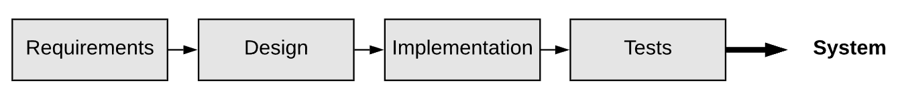

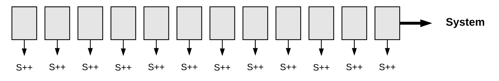

## Agile Manifesto

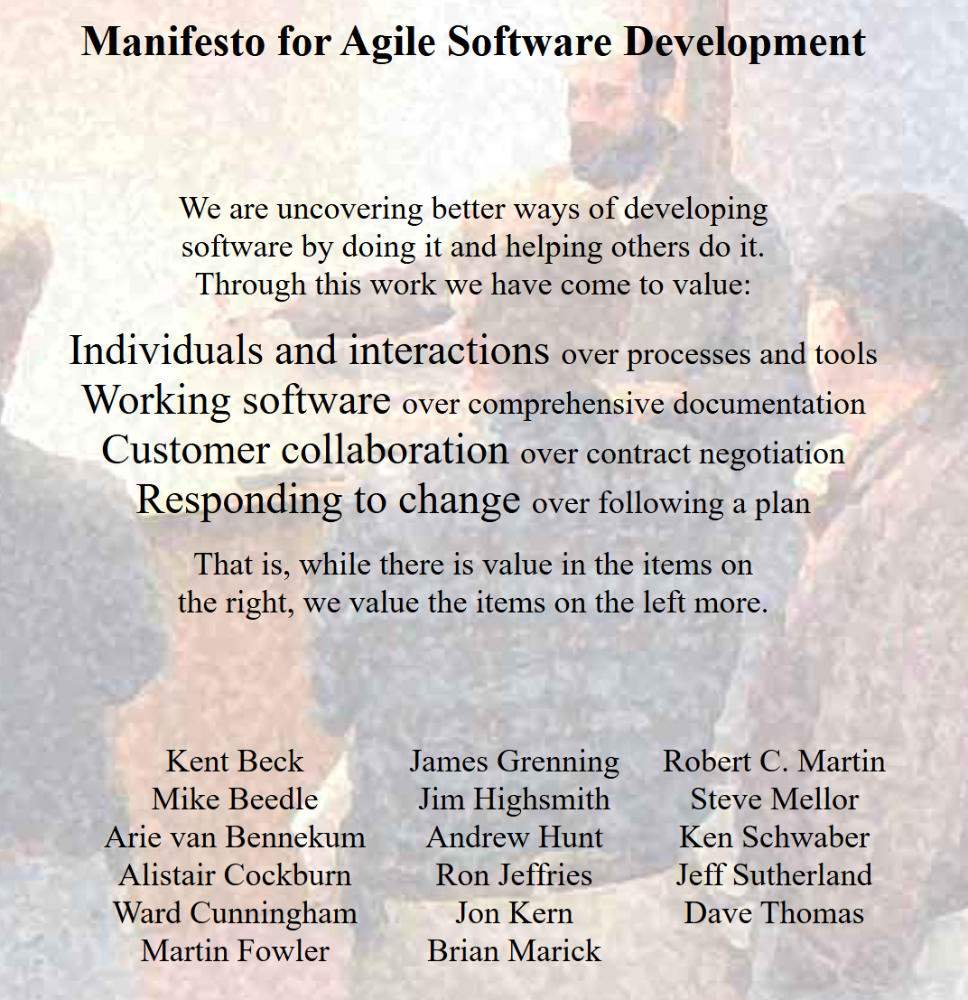

https://agilemanifesto.org/

## Øvelse

- Overvej forskellen på den venstre og højre side i ”The agile  manifesto ”. Hvad betyder det for udvikling af software?
  - Individuals and interactions  over  processes and tools
  - Working software  over  comprehensive documentation
  - Customer collaboration  over  contract negotiation
  - Responding to change  over  following a plan

## Agilt fokus I

- Less emphasis on documentation : Only essential information should be documented, focusing on what is necessary for understanding and maintaining the system.
- Less emphasis on detailed plans : At the start of a project, often neither the customer nor the developers have a clear understanding of all requirements that should be implemented. This understanding gradually unfolds as sprints are completed and their outcomes validated. In essence, the core principle of agile is to progress even when we have incomplete, partial, and changing requirements.

## Agilt fokus II

- No dedicated design phase , i.e., no Big Design Up Front (BDUF): The design of the software is also incremental, evolving with each iteration.

- Small teams : Teams typically consist of around 10-12 developers or, as Amazon CEO Jeff Bezos phrased it, teams that can be fed with two pizzas. This concept can also be compared to the size of sports teams, ranging from a basketball team (5 members) to a soccer team (11 members).

- Emphasis on innovative programming practices  (as of the early 2000s), such as automated testing, refactoring, and continuous integration.

## SCRUM

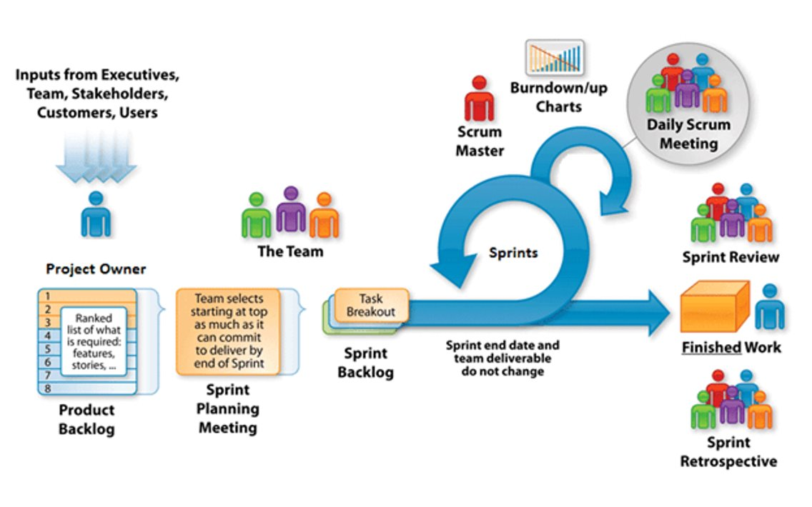

## Kanban

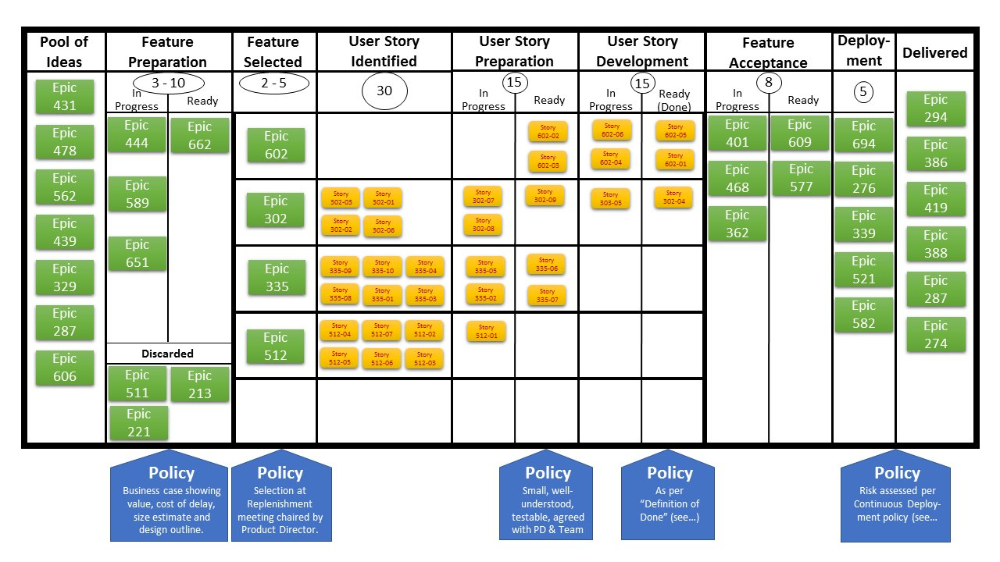

## Øvelse

Find forskellene på Scrum og Kanban

## Systemudviklingsmodeller

- Metoder er anbefalinger
- Organisationer er nødt til at tilpasse og reflektere over brugen af metoderne
- XP, Scrum, and Kanban are examples of agile methods or, in other words, they define practices, activities, events, and techniques that align with agile principles.

## Spiral model (fra 1986)

Defining objectives and constraints, including costs, schedules, etc.

Evaluating alternatives and conducting risk analysis. For instance, considering whether it is more cost-effective to purchase a system instead of developing it in-house.

Development and testing, potentially using the Waterfall model. By the end of this stage, a prototype should be produced for demonstration to users.

Planning for the next iteration or deciding to conclude the project if the current implementation already meets the organization’s needs.

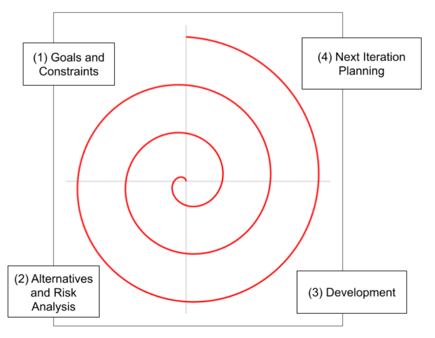

## Rational Unified Process

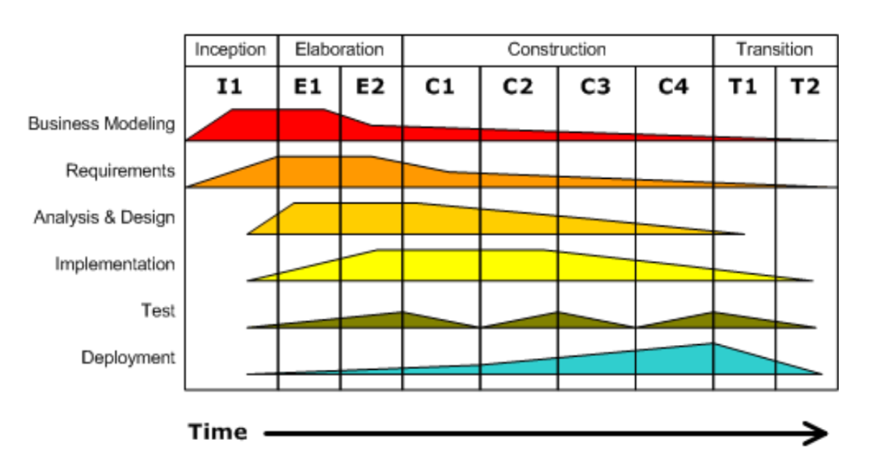

## eXtreme  Programming

Agil tilgang på linje med Scrum og Kanban

Består af

Values (værdisæt/normer)

Principper

Praksis

Vi kigger på en specifik praksis i dag, test driven development

## Test Driven Development

”Test First Development” - Skriv testen før koden

We start with a failing test.

We create the production code on the fly, while building our test.

We’re done when the test(s) pass.

Now we refactor, to optimize the test structure and data.

## Test Driven Development (TDD)

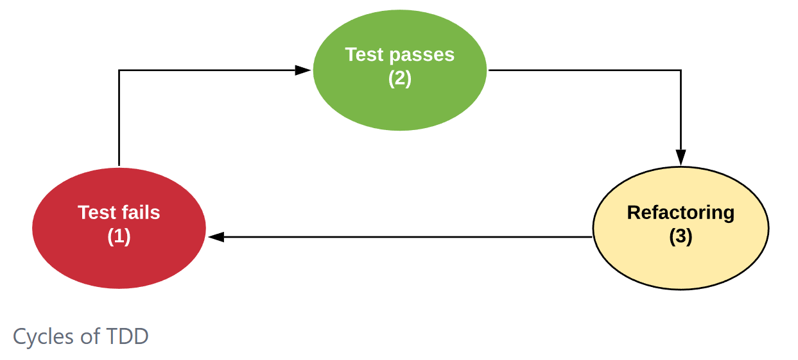

## Hvorfor TDD?

- TDD prevents developers from forgetting to write tests.
  - Prevent developers to forget tests
  - Gives higher test coverage
  - TDD encourages writing code with high testability.
- Since developers first write the test T and then the class C, they are naturally inclined to design C to facilitate testing.
- TDD is not only a testing practice but also a design practice.
- This occurs because developers, by starting with the tests T, put themselves in the position of a user of the class C.
- In other words, with TDD, the first user of the class is its own developer—recall that T is a client of C, as it calls methods from C.
- Therefore, it is expected that developers will define a simple interface for the class, using readable method names and minimizing the number of parameters, among other best practices.

## Hvorfor TDD og IT-arkitektur?
- Som arkitekter definerer vi adfærden (testen). Om det er en juniorudvikler eller en AI, der skriver implementationen, er underordnet. TDD er vores kontrakt.
- Hvorfor lærer vi TDD i dag? Bl.a. fordi når I om to uger skal have AI til at skrive koden for jer, så er TDD en måde, I tjekker, om AI'en er på rette spor.

## Example of TDD: Shopping Cart

## Vi starter med en rød test

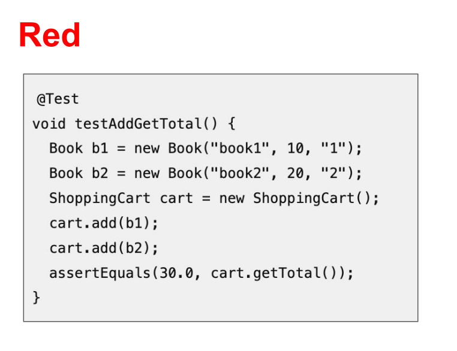

## Kode compiler, men test fejler

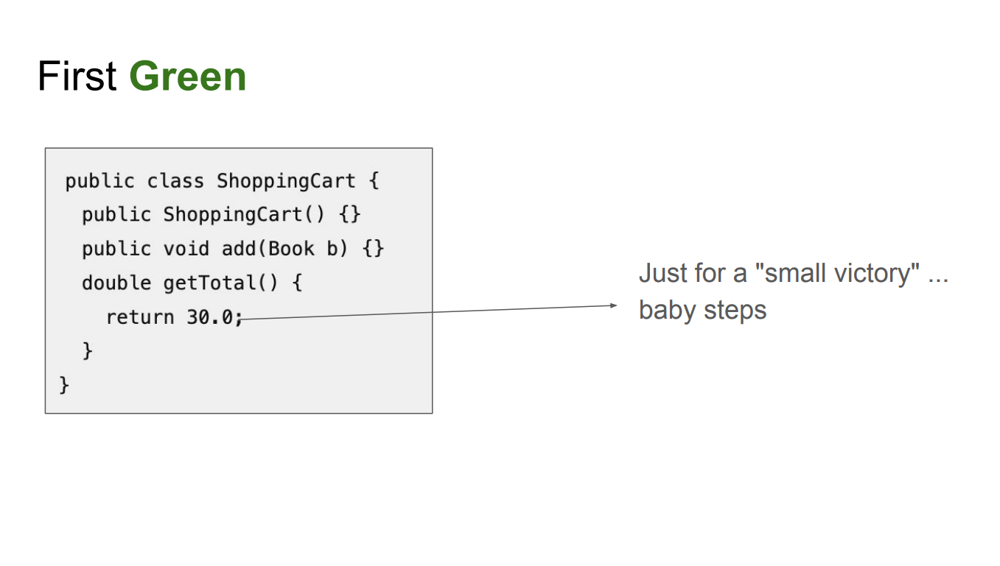

##

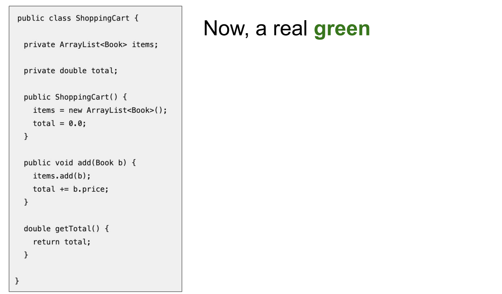

##

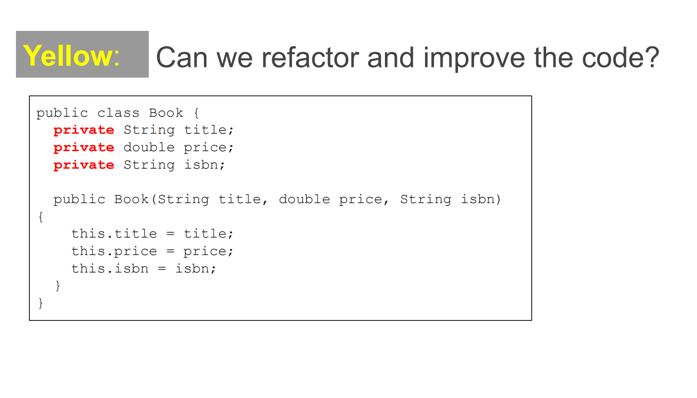

## Opgave

- I arbejder som IT-arkitekter.
- I arbejder et sted, hvor der udvikles i Python.

- I skal komme med et forslag til værktøjer, som kan understøtte udviklernes brug af Test Driven Development
  - Fokus skal være på programmeringsdelen
  - Forestil jer at den nuværende tilgang ikke er TDD
  - Lad jer inspirere af andre – læs, søg, spørg (AI)

- Afprøv et enkelt værktøj

- Præsentation
  - Fremlægges i næste uge for klassen
  - 1 slide
  - Anbefalet værktøj
  - Fordele og ulemper (evt. erfaringer)
  - Evt. en slide med alternativer (bilag)

- Lav evt. En simpel case f.eks. Med en funktion til at tage en kvadratrod. Start med test og fyld så på med de andre ting.

- Spørg en AI: "Act as a Senior Python Architect. Recommend a testing setup for a TDD approach..."

## Muligheder i Python

- Unittest
- Pytest
- Nose2
- Intet framework...

## Pytest

- pytest -html
  - Generates HTML test reports
  - Easy to install: pip install  pytest -html
  - Run with:  pytest  --html=report.html

- pytest-sugar
  - Improves terminal test output
  - Colorful, more readable results
  - Install: pip install pytest-sugar

- Coverage.py
  - Code coverage visualization
  - Shows which code parts are tested
  - Install: pip install coverage
  - Run with: coverage run -m pytest

## Næste gang

Klassisk kravstilling - grundlaget for at kunne "styre" vores AI (som vi kigger på 3. kursusgang)